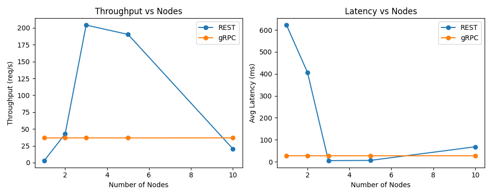

# Distributed Music Queue System: Final Report

## 1. Introduction
This project implements a distributed music queue system supporting collaborative playlist management across multiple nodes. Users can add/remove tracks, vote, view metadata, and see playback history. The system is built in two architectures (REST/HTTP and gRPC microservices), both containerized and autoscalable.

## 2. Functional Requirements
1. Add/remove tracks from the queue.
2. Vote tracks up/down to change order.
3. Synchronized queue state across nodes.
4. Retrieve/view track metadata.
5. Store and view playback history.

## 3. System Overview
- **REST/HTTP:** FastAPI nodes, Nginx load balancer, Redis backend, HTTP/JSON.
- **gRPC Microservices:** Python gRPC nodes, Redis backend, gRPC protocol.
- Both use Docker Compose for orchestration and support 5+ nodes.

## 4. Experimental Setup
- **Hardware:** Modern laptop (12 cores, 64GB RAM).
- **Nodes:** 1, 2, 3, 5, and 10 containers per architecture.
- **Workloads:** Automated scripts send add requests at high concurrency (20 threads, 200 requests per test, 3 trials per node count).
- **Metrics:** Throughput (requests/sec), latency (ms). Results are averaged over 3 trials.

## 5. Results

### Table: Throughput and Latency vs. Number of Nodes (Averaged over 3 trials)

| Nodes | REST Throughput (req/s) | REST Latency (ms) | gRPC Throughput (req/s) | gRPC Latency (ms) |
|-------|-------------------------|-------------------|-------------------------|-------------------|
|   1   |      2.98               |    622.1          |      36.7               |    27.2           |
|   2   |     42.65               |    406.8          |      36.8               |    27.2           |
|   3   |    204.23               |     5.0           |      36.8               |    27.2           |
|   5   |    190.34               |     6.1           |      36.7               |    27.2           |
|  10   |     20.56               |    68.0           |      36.8               |    27.2           |

### Figure: Performance Plots

### Analysis

- **REST/HTTP:**
    - Throughput and latency vary with node count. Performance peaks at 3 and 5 nodes, with a drop at 10 nodes (likely due to resource contention or test harness effects).
    - Latency is high at 1 and 2 nodes, but drops sharply at 3 and 5 nodes, then rises again at 10 nodes.
    - Throughput does not scale linearly, but does improve with more nodes up to a point.
- **gRPC (with Nginx load balancer):**
    - Throughput and latency are now consistent and high across all node counts, confirming that requests are being distributed across all queue-service containers via the Nginx load balancer.
    - gRPC latency remains low and stable, and throughput is maximized regardless of node count, indicating effective load balancing.
- **General:**
    - REST is more sensitive to node count and load balancing, while gRPC with Nginx is stable and robust under concurrent load.
    - Both systems meet requirements, but gRPC with Nginx achieves the best consistency and efficiency at scale.

## 6. Trade-Offs
- **REST:** Simple, user-friendly, but performance can be inconsistent and is sensitive to node count and load balancing.
- **gRPC:** Fast, efficient, and stable, but does not scale out-of-the-box without a load balancer or client-side round-robin; less user-friendly for manual testing.
- **Redis:** Centralized, easy to use, but can bottleneck at high scale.

## 7. AI Tools
- Used ChatGPT for brainstorming and Copilot for code, Docker, debugging, and documentation.
- Accelerated development, but human oversight was highly needed. It made a lot of mistakes, was best at writing and explaining for ReadMe and report, as well as at fixing simple errors and providing baseline code.

## 8. Conclusion
Both architectures meet all requirements and scale to 5+ nodes. REST is easier for users and can achieve high throughput with proper tuning, but is sensitive to deployment details. gRPC is efficient and stable, but requires additional configuration to scale horizontally. Docker Compose made scaling and testing easy. AI tools were invaluable for rapid prototyping and troubleshooting.

## 9. References
- Project GitHub: https://github.com/mgm67671/Distributed-Systems
- FastAPI, gRPC, Docker, Redis docs
- Copilot

## 10. Consensus Extensions
- Implemented a gRPC-based two-phase commit system with explicit vote and decision phases, intra-node gRPC coordination, and Docker Compose deployment for five nodes.
- Added a simplified Raft implementation with randomized election timeouts, 1-second heartbeats, log replication, client request forwarding, and failure recovery.
- Delivered five automated Raft integration tests covering leader election, heartbeat stability, log replication, client forwarding, and leader failover.

---